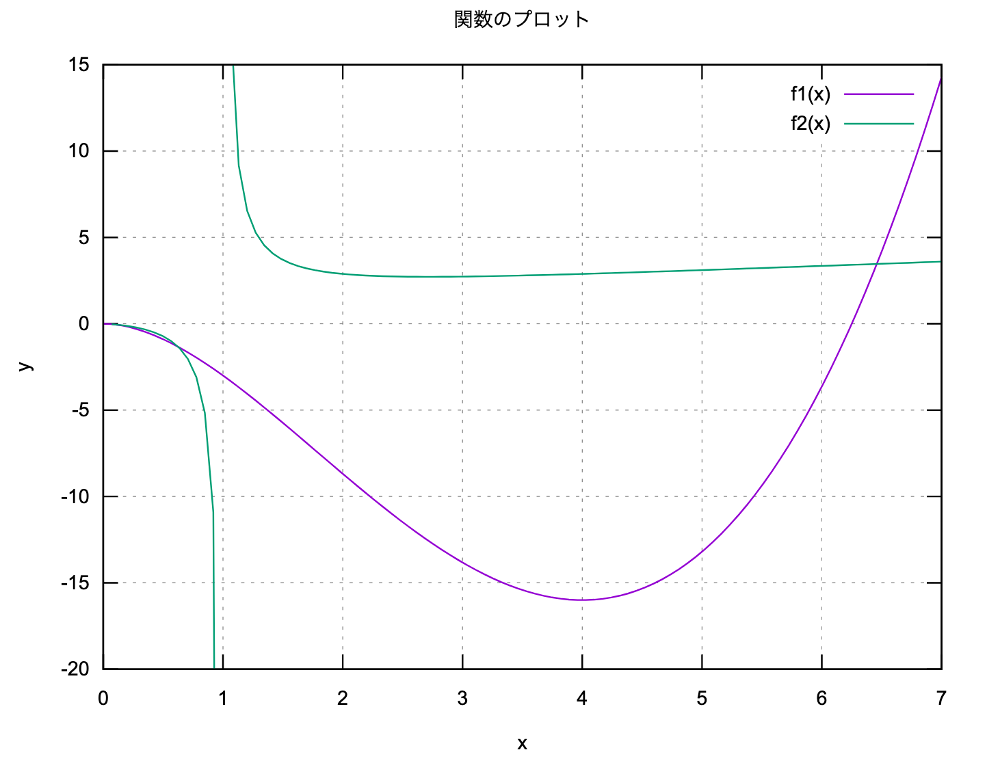
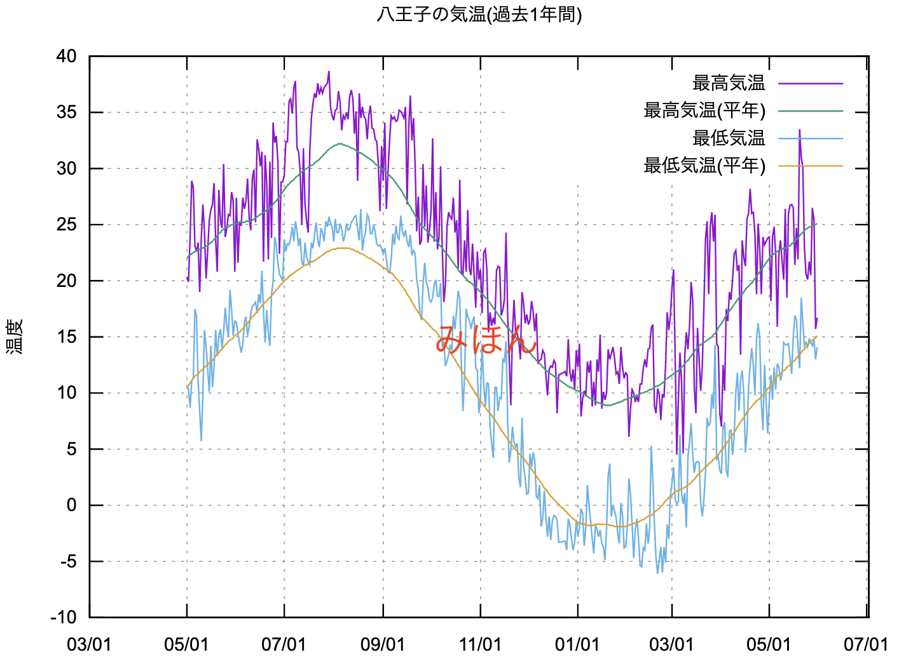
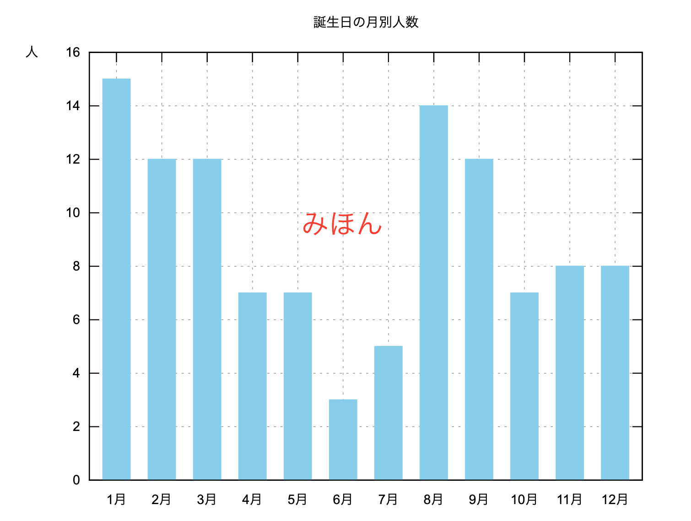

# gnuplot 演習
## 1. 対話的に作成したグラフ

前半でGnuplotに対話的にコマンドを入力して作成したグラフ`force.png`がこの下に入る．
正しくできていれば，次の条件を満している．

- グラフの折れ線にはデータの点を示す印が入っている．
- 図の上に「力-たわみ」というタイトルが付いている．
- 軸には，縦軸「力(kN)」，横軸「たわみ(m)」のラベルが付いている．
- 図の右上に凡例が入っている．


## 2. 関数のプロット

次の「みほん」の図と同じようになるように gnuplotの記述を追記せよ.

- 関数は $y = f1(x) =2x^2\sqrt{x}-5x^2$ と $\displaystyle y= f2(x) = \frac{x}{\log{x}}$ とする．
- xの範囲を $0 \leq x \leq 7$ に，yの範囲を $-20 \leq y \leq 15$にする．
- グラフのタイトル，x軸のラベル，y軸のラベルを付ける．
- 格子状の補助線を入れる．
- 凡例は，`f1(x)` と `f2(x)` にする．



```gnuplot {cmd=true output="html"}
set terminal svg

```

## 3. 八王子の気温

次の図と同じようになるように gnuplotの記述を追記せよ.

- データは `weather2024.csv` から取り出す
  - CSV である (データが 「 , 」で区切られている)ことに注意
- データとして1列目をx軸，2から4列目をy軸に指定し，
折れ線グラフにし，凡例を付ける
- グラフのタイトル，x軸のラベル，y軸のラベルを付ける
- 格子状の補助線を入れる



```gnuplot {cmd=true, output="html"}
set terminal svg
set xdata time
set timefmt '%Y/%m/%d'
set xtics format "%m/%d"

```

## 4． 誕生月

次の「みほん」の図と同じようになるように gnuplotの記述を追記せよ.



- データは `bm.txt` から取り出し，棒グラフにする
- y軸の範囲は $0 \le y \le 16$とする
- 棒グラフは水色(skyblue)で塗り潰し，棒の幅は 0.6 にする
- グラフのタイトルを付ける
- y軸のラベル「人」を付ける
- x軸の目盛には「1月」のように月が入る
- 格子状の補助線を入れる

```gnuplot {cmd=true, output="html"}
set terminal svg
unset key


```
