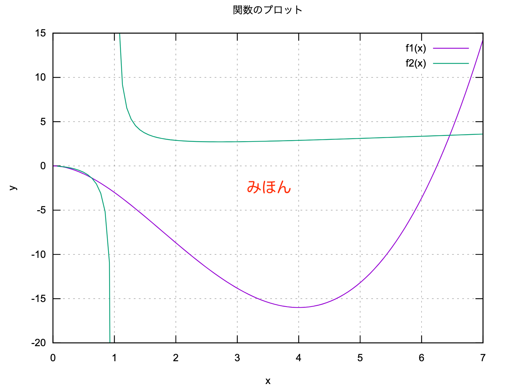

# gnuplot 演習

## 1．関数のプロット

次の図と同じようになるように gnuplotの記述を追記せよ.

- 関数は $y = f1(x) =2x^2\sqrt{x}-5x^2$ と $\displaystyle y= f2(x) = \frac{x}{\log{x}}$ とする
- xの範囲を $0 \leq x \leq 7$ に，yの範囲を $-20 \leq y \leq 15$にする
- グラフのタイトル，x軸のラベル，y軸のラベルを付ける
- 格子状の補助線を入れる



```gnuplot {cmd=true output="html"}
set terminal svg

```

## 2．東京都新型コロナ感染者数

次の図と同じようになるように gnuplotの記述を追記せよ.

- データファイルは `tokyo_covid19_all.dat`
- データとして1列目と2列目を指定し，折れ線グラフにする
- グラフのタイトル，x軸のラベル，y軸のラベルを付ける
- 格子状の補助線を入れる


```gnuplot {cmd=true output="html"}
set terminal svg
set xdata time
set timefmt '%Y-%m-%d'


```

## 3．東京都新型コロナ感染者数(年代別)

次の図と同じようになるように gnuplotの記述を追記せよ.

- データは `tokyo_covid19_2022.dat` から取り出している．
- データとして1列目と3列目を指定し，折れ線グラフにし，凡例を付ける
- グラフのタイトル，x軸のラベル，y軸のラベルを付ける
- 格子状の補助線を入れる


```gnuplot {cmd=true output="html"}
set terminal svg
set xdata time
set timefmt '%Y-%m-%d'

data0='<grep "10歳未満" tokyo_covid19_2022.dat'
data1='<grep "10代" tokyo_covid19_2022.dat'
data2='<grep "20代" tokyo_covid19_2022.dat'
data9='<grep "90代" tokyo_covid19_2022.dat'
data10='<grep "100歳以上" tokyo_covid19_2022.dat'

# 見易くするために \ を入れて 改行 をしている．
plot data0 using 1:3 with lines title "10歳未満",\
data10 using 1:3 with lines title "100歳以上"
```
